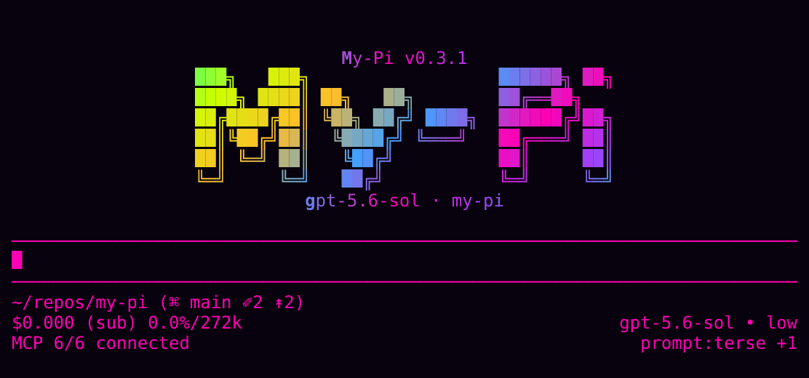

# my-pi

[](https://github.com/spences10/my-pi/actions/workflows/semgrep.yml)
[](https://viteplus.dev)
[](https://vitest.dev)

My curated [Pi](https://pi.dev) distribution: a ready-to-run
coding-agent CLI with MCP, LSP, skills, recall, redaction, telemetry,
team mode, prompt presets, and other handy extensions prewired.



Built on the
[@earendil-works/pi-coding-agent](https://github.com/badlogic/pi-mono)
SDK. Use the full distribution directly, or install individual
`@spences10/pi-*` packages into your own Pi setup.

## Quick start

```bash
pnpx --allow-build=@google/genai --allow-build=protobufjs my-pi@latest
# or: npx my-pi@latest / bunx my-pi@latest
```

## Two ways to use my-pi

### 1. Run the full distribution

Use `my-pi` if you want the complete, opinionated setup:

```bash
pnpx --allow-build=@google/genai --allow-build=protobufjs my-pi@latest
```

This is its own CLI wrapper around Pi. Do not install the root package
with `pi install npm:my-pi`.

### 2. Install individual Pi packages

Most extensions in this repo are also published as normal Pi packages:

```bash
pi install npm:@spences10/pi-lsp
pi install npm:@spences10/pi-mcp
pi install npm:@spences10/pi-redact
```

Use this path if you already have your own Pi setup and only want
selected features. Package READMEs are the source of truth for install
instructions, commands, configuration, and runtime behavior.

### Programmatic use

`create_my_pi()` accepts upstream `InlineExtension` values, including
named wrappers that keep startup extension paths descriptive. Bare
factory functions remain supported.

```typescript
import { create_my_pi, type InlineExtension } from 'my-pi';

const audit_extension: InlineExtension = {
	name: 'audit-events',
	factory(pi) {
		pi.on('agent_start', () => console.log('agent started'));
	},
};

const runtime = await create_my_pi({
	extensionFactories: [audit_extension],
});
```

The wrapper above appears as `<inline:audit-events>` in Pi's startup
Extensions list.

## What you get

- **Pi-native CLI + SDK wrapper** — interactive TUI, print mode, JSON
  mode, RPC mode, and programmatic runtime creation.
- **Project-aware MCP tools** — stdio and HTTP/streamable-HTTP servers
  from `mcp.json`, scoped so sensitive or noisy tools only load for
  the projects and orgs where they belong.
- **Project-aware skills** — discover, enable, disable, import, and
  sync Pi-native skills, with different skill sets per project.
- **LSP tools** — diagnostics, hover, definitions, references, and
  document symbols via language servers.
- **Context sidecar** — local SQLite storage for oversized tool
  output, keeping long results searchable without flooding chat
  context.
- **Guardrails** — Svelte and coding-preference checks that block
  configured anti-patterns before agents write them.
- **Prompt presets** — base presets plus additive prompt layers with
  per-project persistence.
- **Secret safety** — redaction plus reminders to use secret-safe
  environment loading.
- **Recall, telemetry, and observability** — local support for
  prior-session lookup, evals, latency analysis, live event streams,
  and operational debugging.
- **Git UI** — interactive source-control staging and commit support.
- **Team mode** — peer coordination between independently opened Pi
  sessions using groups, artifacts, and durable mailboxes.
- **Themes and TUI helpers** — visual polish and shared modal
  primitives.

## Requirements

- Node.js `>=24.15.0`
- pnpm 11 for local development
- Pi authentication via `pi auth`, provider environment variables, or
  supported OAuth flows

`my-pi` uses native `node:sqlite` through context, telemetry, and
observability packages. The CLI suppresses Node's expected
`node:sqlite` `ExperimentalWarning`; standalone package/API consumers
own their process warning policy until Node marks it stable.

### pnpm 11 first-run build approval

pnpm 11 asks for interactive approval before running the transitive
`@google/genai` preinstall and `protobufjs` postinstall hooks. Neither
hook builds runtime artifacts: the first prints a no-op message and
the second only checks dependency version syntax. Declining them does
not degrade `my-pi` functionality.

For a deterministic first run, or after accidentally selecting `No`,
rerun the Quick start command with both `--allow-build` flags. It
allows those two known hooks without the two-stage selection and
confirmation prompt. The package does not publish a `pnpm` settings
block because pnpm 11 ignores package-level build policy. The
`node-domexception` deprecation notice is also transitive and does not
affect runtime behavior.

## Common usage

```bash
# full TUI
pnpx my-pi@latest

# one-shot print mode
pnpx my-pi@latest "summarize this repo"
pnpx my-pi@latest -P "explicit print mode"

# NDJSON events for scripts/agents
pnpx my-pi@latest --json "list all TODO comments"

# RPC mode for team/agent orchestration
pnpx my-pi@latest --mode rpc

# local live observability dashboard
pnpx my-pi@latest
# then run /observability in the TUI to open the browser dashboard
pnpx my-pi@latest observability
```

Pi handles model authentication natively. For provider-specific model
examples, see the Pi docs and the relevant extension/package README.

Umans.ai is available as a built-in provider. Run `/login`, choose API
key auth, then choose Umans; select models like `umans/umans-coder` or
`umans/umans-flash`. The provider can also read `UMANS_API_KEY` and
can be disabled with `--no-umans-provider`.

OpenRouter Fusion is configured by default: `my-pi` injects a
non-Anthropic Fusion panel/judge only for `openrouter/fusion`.
Configure it in `~/.pi/agent/my-pi-settings.json` under
`openRouterFusion`, e.g.
`{"openRouterFusion":{"analysisModels":["deepseek/deepseek-v3.2"],"judgeModel":"~openai/gpt-latest","force":false}}`.
Fusion is forced by default with `tool_choice: "required"`; set
`force: false` to let OpenRouter decide whether deliberation is
needed. Env vars `MY_PI_FUSION_ANALYSIS_MODELS`,
`MY_PI_FUSION_JUDGE_MODEL`, and `MY_PI_FUSION_FORCE` still work as
overrides. Disable with `--no-openrouter-fusion-config`.

## Reusable Pi packages

Install the full distribution with `pnpx my-pi@latest`, or install
selected extensions into vanilla Pi:

```bash
# Bash/Zsh/Fish
pi install npm:@spences10/pi-{context,lsp,team-mode}
```

Full package list here:

| Package                                                                            | Purpose                                                    |
| ---------------------------------------------------------------------------------- | ---------------------------------------------------------- |
| [`@spences10/pi-coding-preferences`](./packages/pi-coding-preferences/README.md)   | Configurable coding-workflow guardrails                    |
| [`@spences10/pi-confirm-destructive`](./packages/pi-confirm-destructive/README.md) | Destructive action confirmations                           |
| [`@spences10/pi-context`](./packages/pi-context/README.md)                         | Scoped SQLite FTS overflow cache for oversized tool output |
| [`@spences10/pi-codex-usage`](./packages/pi-codex-usage/README.md)                 | OpenAI Codex usage in the footer status area               |
| [`@spences10/pi-factory`](./packages/pi-factory/README.md)                         | Reusable software-factory control plane                    |
| [`@spences10/pi-git-ui`](./packages/pi-git-ui/README.md)                           | Interactive source-control staging UI                      |
| [`@spences10/pi-lsp`](./packages/pi-lsp/README.md)                                 | LSP-backed diagnostics and symbol tools                    |
| [`@spences10/pi-mcp`](./packages/pi-mcp/README.md)                                 | MCP server integration and `/mcp`                          |
| [`@spences10/pi-nopeek`](./packages/pi-nopeek/README.md)                           | `nopeek` reminder for secret-safe environment loading      |
| [`@spences10/pi-observability`](./packages/pi-observability/README.md)             | Live local event stream and browser dashboard              |
| [`@spences10/pi-omnisearch`](./packages/pi-omnisearch/README.md)                   | `mcp-omnisearch` reminder for verified web research        |
| [`@spences10/pi-recall`](./packages/pi-recall/README.md)                           | `pirecall` reminder and background sync                    |
| [`@spences10/pi-redact`](./packages/pi-redact/README.md)                           | Output redaction and `/redact-stats`                       |
| [`@spences10/pi-harness`](./packages/pi-harness/README.md)                         | Ephemeral task harness runtime                             |
| [`@spences10/pi-skills`](./packages/pi-skills/README.md)                           | Skill management, import, and sync                         |
| [`@spences10/pi-sqlite-tools`](./packages/pi-sqlite-tools/README.md)               | `mcp-sqlite-tools` reminder for safer SQLite database work |
| [`@spences10/pi-svelte-guardrails`](./packages/pi-svelte-guardrails/README.md)     | Svelte pattern guardrails                                  |
| [`@spences10/pi-team-mode`](./packages/pi-team-mode/README.md)                     | Peer-session coordination and durable mailboxes            |
| [`@spences10/pi-telemetry`](./packages/pi-telemetry/README.md)                     | Local SQLite telemetry and `/telemetry`                    |
| [`@spences10/pi-themes`](./packages/pi-themes/README.md)                           | Bundled theme pack for Pi                                  |

Shared helper packages such as `@spences10/pi-child-env`,
`@spences10/pi-footer`, `@spences10/pi-project-trust`,
`@spences10/pi-settings`, `@spences10/pi-skill-importer`,
`@spences10/pi-sqlite-core`, and `@spences10/pi-tui-modal` are
published as dependencies and are not packages to install via
`pi install`. See [`docs/package-map.md`](./docs/package-map.md) for
the authoritative classification.

Maintainers publish from GitHub Actions with npm trusted publishing;
see [`docs/releases.md`](./docs/releases.md) for the workflow and the
required owner-side configuration.

## Project structure

```text
apps/
  web/                     Landing page for discovering my-pi and its packages
src/
  index.ts                 CLI entry point
  api.ts                   Programmatic API
  extensions/              Root-only built-ins and distro wiring
packages/
  pi-*/                    Reusable Pi packages and shared support packages
.pi/
  presets.json             Optional project prompt presets
  presets/*.md             Optional project prompt preset files
mcp.json                   Optional, user-created project MCP server config
```
